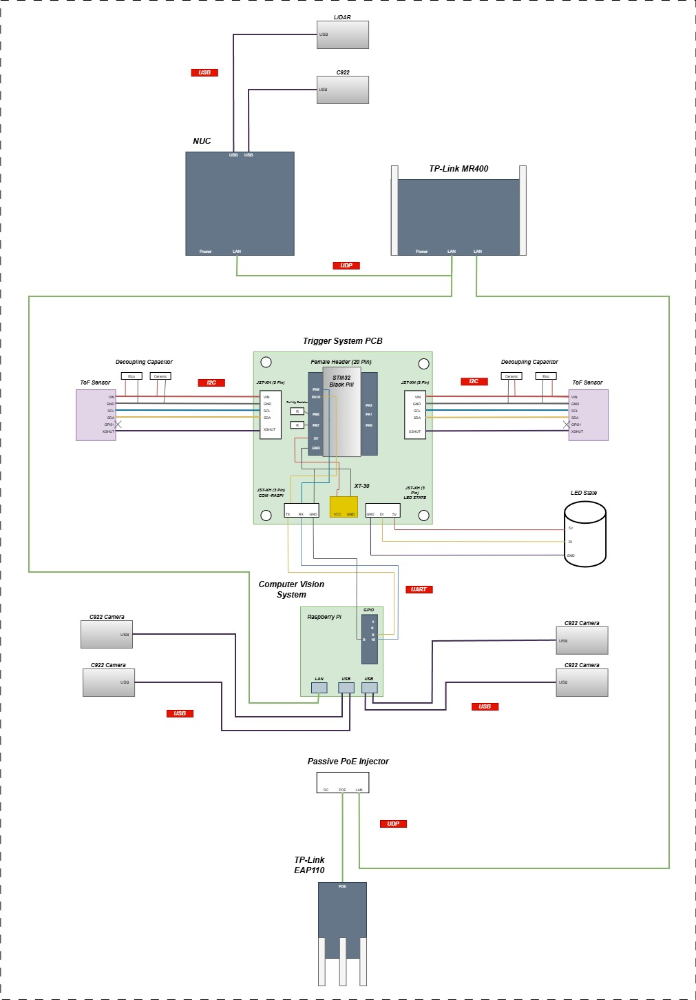

# 🏗️ Arsitektur Sistem, Komunikasi & Pengabelan ASV Gamantaray 

Dokumen ini menjelaskan arsitektur tingkat tinggi (high-level architecture), topologi jaringan komunikasi, serta detail pengabelan sinyal kontrol pada kapal otonom ASV Gamantaray Safinah One 2026.

---

## 1. Arsitektur Jaringan & Distribusi Komponen (System Architecture)

Diagram di bawah ini menunjukkan distribusi fisik komponen antara lambung kapal (Hull A & Hull B), susunan geladak (Deck A & Deck B), serta jalur komunikasi ke Stasiun Pengendali Darat (Ground Control Station - GCS).

### A. Pembagian Kompartemen Fisik
* **HULL A & HULL B (Sistem Penggerak & Sensor Samping):** Masing-masing lambung dilengkapi dengan 2x Thruster Blue Robotics T200 (dikendalikan via ESC 30A), 1x Servo TD-8120MG untuk artikulasi mekanik, 1x Sensor Jarak TOF VL53LXX, dan 2x Kamera Logitech C922.
* **DECK A (Pusat Komputasi & Navigasi):** Berisi komponen komputasi utama (Intel NUC & Raspberry Pi 4), Flight Controller Pixhawk 6C, Mikrokontroler STM32 Black Pill, Modul GPS UM980, dan Router Utama TP-Link Archer-MR400.
* **DECK B (Sistem Jaringan Luar & Indikator):** Pada bangunan atas kapal diletakkan router TP-Link EAP110 untuk transmisi nirkabel jarak jauh dan modul LED State WS2812B.

### B. Protokol Komunikasi Data
Sistem ini memanfaatkan 5 jenis protokol komunikasi utama untuk menjamin koordinasi antar-perangkat:

| Protokol | Jalur Koneksi (Dari $\rightarrow$ Ke) | Fungsi / Data yang Ditransmisikan |
| :---: | :--- | :--- |
| **UDP (Ethernet)** | Intel NUC, RPi 4, Pixhawk 6C, EAP110 $\rightarrow$ Router MR400 | Jaringan lokal (*LAN*) kapal & interkoneksi data ROS/MAVLink kecepatan tinggi |
| **Wi-Fi 2.4 GHz** | GCS (TP-Link CPE210) $\leftrightarrow$ Kapal (TP-Link EAP110) | Jalur telemetri, data sensor, dan kendali otonom jarak jauh dari darat |
| **UART / Serial** | • Pixhawk 6C $\leftrightarrow$ Raspberry Pi 4 • STM32 Black Pill $\rightarrow$ Raspberry Pi 4 • Pixhawk 6C $\rightarrow$ GPS UM980 | • Pengiriman data navigasi/status • Pengiriman data sensor jarak (*Trigger*) |
| **I2C** | STM32 Black Pill $\leftrightarrow$ 2x Sensor TOF VL53LXX | Pembacaan data jarak digital dari lambung A dan B |
| **USB** | • Intel NUC $\leftrightarrow$ RPLidarC1 & 1x Kamera C922 • Raspberry Pi 4 $\leftrightarrow$ 4x Kamera C922 | Transfer data sensor spasial (LiDAR) & streaming video *Computer Vision* |
| **PWM** | Pixhawk 6C $\rightarrow$ ESC 30A & Servo TD-8120MG | Sinyal kontrol kecepatan thruster dan posisi servo |

---

## 2. Diagram Pengabelan Detail Sinyal (Communication Wiring Diagram)

Diagram berikut menjelaskan detail pinout, interkoneksi elektrikal sinyal data, serta komponen pasif penunjang stabilitas sinyal pada Trigger System PCB dan Computer Vision System.

### A. Sub-Sistem Trigger PCB (STM32F401 Black Pill)
* **Bus I2C & Penanganan Noise:** Sensor TOF terhubung ke pin I2C STM32 (`PB6` & `PB7`). Dilengkapi dengan **Resistor Pull-Up (R)** pada jalur data/jam serta kombinasi **Decoupling Capacitor** (Kapasitor Elektrolit + Keramik) secara paralel di dekat sensor untuk memfilter noise tegangan. Pin `PA0` dan `PA1` digunakan sebagai jalur `XSHUT` untuk mengaktifkan/mematikan sensor secara sekuensial guna menghindari tabrakan alamat (*address conflict*).
* **Interkoneksi ke Raspberry Pi:** Menggunakan konektor JST-XH 3-Pin via jalur **UART** (`PA9-TX` dan `PA10-RX`) untuk mengirimkan data jarak yang telah diolah.
* **Kontrol Lampu Indikator:** Pin `PA2 (LED STATE)` terhubung langsung ke pin *Data Input* (DI) pada modul **LED State WS2812B** melalui konektor JST-XH 3-Pin.

### B. Sub-Sistem Jaringan & Vision (Intel NUC & Raspberry Pi)
* **Manajemen Kamera:** Untuk mencegah *bottleneck* daya dan data, 4 unit kamera Logitech C922 ditangani oleh port USB Raspberry Pi 4, sedangkan 1 unit kamera utama bersama dengan **RPLidarC1** dihubungkan ke port USB Intel NUC Pro 12.
* **Topologi Jaringan Lokal:** Intel NUC dan Raspberry Pi terhubung ke port LAN **TP-Link MR400** menggunakan kabel Ethernet (UDP). Akses point outdoor **TP-Link EAP110** dihubungkan ke sistem jaringan melalui **Passive PoE Injector** untuk mendapatkan suplai daya sekaligus interkoneksi data ke router utama.

---

## 3. Arsitektur Manajemen Daya (Power Distribution Diagram)

Untuk mendukung kestabilan seluruh interkoneksi komunikasi di atas, daya didistribusikan dari baterai tunggal LiPo 14.8V melalui pembagian beberapa regulator khusus (*Multi-voltage Rail*).

* **Rail 5V (UBEC 10A):** Menjamin kestabilan daya untuk Raspberry Pi 4 yang mendrive 4 kamera sekaligus, STM32, serta LED State.
* **Rail 5V (PM02 Modul Daya):** Terisolasi khusus untuk Flight Controller Pixhawk 6C agar terhindar dari interferensi beban komputasi.
* **Rail 12V (Mini560):** Menyediakan daya untuk sistem pendingin (4x Fan 12V) dan Router TP-Link MR400.
* **Rail 19V (WMX Step-Up):** Menyuplai daya tinggi yang stabil untuk SBC Intel NUC Pro 12 i5.
* **Rail 24V (XL6009 Step-Up):** Khusus digunakan untuk menyuplai daya Router TP-Link EAP110.
