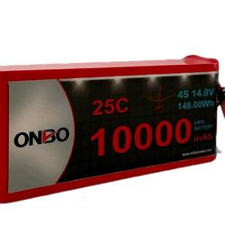

# ⚡ Power Budget Analysis & Control System Endurance Estimation

Dokumen ini memuat analisis konsumsi daya teoritis murni untuk **Sistem Kontrol, Komputasi, dan Komunikasi** ASV Gamantaray. Sistem propulsi (Thruster & ESC) menggunakan baterai dan jalur distribusi daya terpisah untuk menghindari kendala interferensi elektrikal (*electrical noise*).

### 🔋 Spesifikasi Sumber Daya Sistem Kontrol

* **Tipe Baterai:** LiPo 4S (4 Sel) khusus sistem kontrol
* **Tegangan Nominal:** 14.8 V
* **Kapasitas:** 10000 mAh (10 Ah)
* **Discharge:** 25C
* **Safety Limit (Aturan 80%):** Maksimal kapasitas yang digunakan adalah 8000 mAh (8 Ah) demi menjaga kesehatan sel baterai.

---

## 1. Tabel Konsumsi Daya Elektronika (Control System Power Budget)

Arus pada komponen di bawah ini dihitung berdasarkan tegangan kerja masing-masing setelah melewati regulator (5V, 12V, 19V, 24V) yang bersumber dari Control Board utama.

| Komponen / Sub-Sistem | Tegangan Kerja (V) | Arus Nominal (A) | Arus Peak (A) | Daya Nominal (W) | Daya Peak (W) |
| :--- | :---: | :---: | :---: | :---: | :---: |
| **SBC Intel NUC Pro 12 i5** | 19.0 V | 1.50 A | 3.00 A | 28.50 W | 57.00 W |
| **SBC Raspberry Pi 4 B + 4x Cam** | 5.0 V | 2.50 A | 5.00 A | 12.50 W | 25.00 W |
| **Pixhawk 6C + Perifer + 2x Servo** | 5.0 V | 0.80 A | 3.00 A | 4.00 W | 15.00 W |
| **Router TP-Link Archer-MR400 + 4x Fan**| 12.0 V | 0.80 A | 1.50 A | 9.60 W | 18.00 W |
| **Router TP-Link EAP110** | 24.0 V | 0.20 A | 0.50 A | 4.80 W | 12.00 W |
| **STM32 Black Pill + 2x TOF Sensor** | 5.0 V | 0.10 A | 0.20 A | 0.50 W | 1.00 W |
| **TOTAL KEBUTUHAN DAYA ELEKTRONIKA** | - | - | - | **59.90 W** | **128.00 W** |

---

## 2. Perhitungan Energi Tersedia (Usable Energy)

1. Total Energi Teoretis Baterai:
   E_total = Kapasitas (Ah) x Tegangan Nominal (V)
   E_total = 10 Ah x 14.8 V = 148 Wh

2. Energi yang Aman Digunakan (80% Usable Capacity):
   E_usable = 148 Wh x 0.80 = 118.4 Wh

3. Efisiensi Regulator Daya (Losses Factor):
   Regulator DC-to-DC (Mini560, XL6009, WMX) pada PDB memiliki efisiensi rata-rata ~88%. Oleh karena itu, daya beban aktual yang ditarik dari baterai akan sedikit lebih tinggi dari daya nominal komponen resmi.

---

## 3. Estimasi Daya Tahan Baterai Sistem Kontrol (Endurance Estimation)

Perhitungan daya tahan baterai kontrol dibagi menjadi dua skenario beban kerja komputasi:

### Skenario A: Nominal / Cruise Operational Mode
Skenario normal saat kapal berlayar otonom melakukan misi. Seluruh komputer, router, dan sensor aktif memproses data secara konstan.
* Total Daya Komponen: 59.90 W
* Daya Aktual dari Baterai (Telah memperhitungkan efisiensi regulator 88%): 59.90 W / 0.88 = 68.07 W
* Rumus: Endurance = E_usable / Daya Aktual Nominal
* Perhitungan: 118.4 Wh / 68.07 W = 1.74 Jam
* **Estimasi Endurance Sistem Kontrol: ± 1 Jam 44 Menit**

### Skenario B: Peak Operational Mode (Beban Komputasi Maksimum)
Skenario ekstrim saat Intel NUC sedang melakukan pemrosesan algoritma pemetaan/AI yang berat, semua kamera melakukan *streaming* penuh, dan servo bergerak konstan secara simultan.
* Total Daya Peak Komponen: 128.00 W
* Daya Aktual dari Baterai (Telah memperhitungkan efisiensi regulator 88%): 128.00 W / 0.88 = 145.45 W
* Rumus: Endurance = E_usable / Daya Aktual Peak
* Perhitungan: 118.4 Wh / 145.45 W = 0.81 Jam
* **Estimasi Endurance Terendah: ± 49 Menit**
